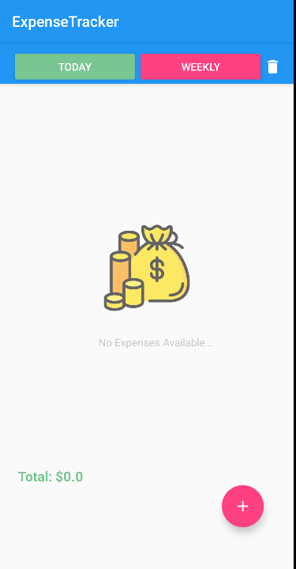
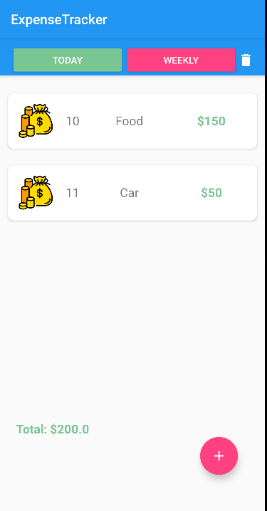
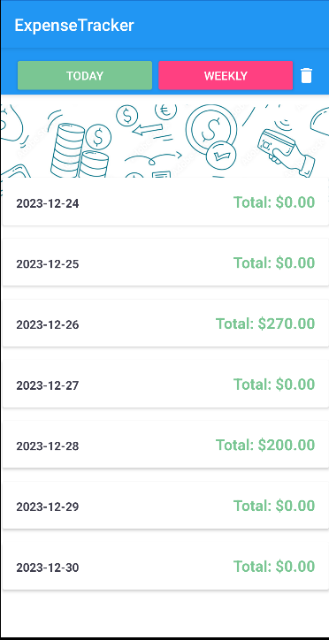
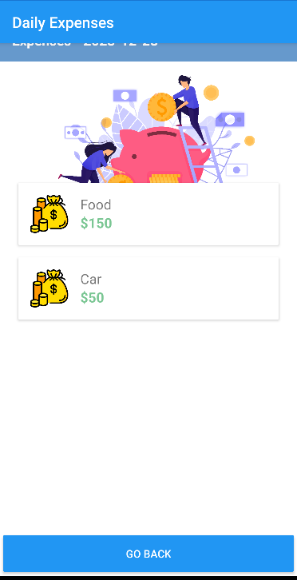
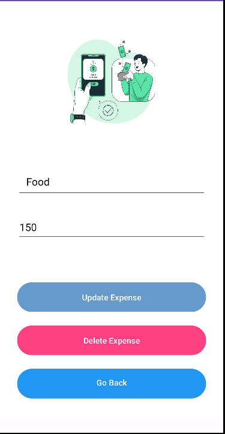
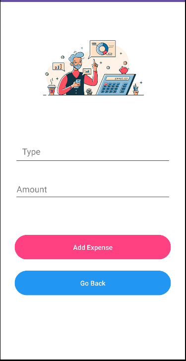

# Expense Tracker - Android App

Welcome to Expense Tracker, your go-to solution for efficient expense tracking on the go! Designed with simplicity and usability in mind, this Expense Tracker app empowers you to manage your finances seamlessly. Whether you're monitoring daily expenditures or analyzing weekly budgets, my app is here to simplify your financial management.

## Screenshots

Here are some screenshots of the Expense Tracker app in action:

       

       

## Key Features

### Expense Tracking

- Users can record their daily expenses, including the type of expense and the amount spent.
- The app organizes expenses based on the current date and allows users to view today's expenses.

### Daily and Weekly Overviews

- The main page provides a summary of today's expenses, including the total amount spent.
- Users can switch to a weekly view to see a breakdown of expenses for each day of the week.

### Expense Details

- Users can click on individual expenses to view and update their details, such as the expense type and amount.

### Adding New Expenses

- The app includes functionality to add new expenses with a specific expense type and amount.

### Deletion of Expenses

- Users can delete today's expenses in one go using the "Delete" button.
- In the weekly view, there is an option to delete all expenses for the entire week.

### Total Expenses Calculation

- The app calculates and displays the total amount spent for the selected date or week.

### Database Integration

- Utilizes SQLite database to store and manage expense data efficiently.

### User-Friendly Interface

- The app features a clean and intuitive user interface, making it easy for users to navigate and interact with the expense data.

### Consistent Design

- The project maintains a consistent design pattern throughout the activities for a cohesive user experience.

### Code Modularity

- The code is organized into multiple classes (e.g., MyDataBaseHelper, CustomAdapter, WeeklyAdapter) for improved modularity and maintainability.

### Update Existing Expenses

- Users can update existing expenses, modifying the expense type or amount.

### Data Validation

- The app incorporates data validation to ensure that users enter valid information when adding or updating expenses.

## Technologies Employed

- **Android Studio:**
  - The official integrated development environment (IDE) for Android app development.

- **Java Programming Language:**
  - The primary programming language used for Android app development in this project.

- **SQLite Database:**
  - A lightweight relational database management system used for local data storage in Android apps.

- **RecyclerView:**
  - The RecyclerView widget is used to display a scrollable list of expenses in a flexible and efficient manner.

- **Intents:**
  - Android Intents are used for navigating between different activities within the app, facilitating communication and data transfer between them.

- **Android Layout XML:**
  - XML is used to define the layout and appearance of UI elements in Android app screens.

- **Android Views and Widgets:**
  - Various Android views and widgets such as TextView, Button, ImageButton, FloatingActionButton, etc., are used to create the user interface.

- **AlertDialog:**
  - AlertDialog is employed for displaying confirmation dialogs, such as confirming the deletion of expenses.

- **Material Design Components:**
  - Material Design components and guidelines are followed to ensure a modern and consistent user interface.

- **RecyclerView Adapter:**
  - Custom RecyclerView adapters (CustomAdapter and WeeklyAdapter) are created to manage the data and bind it to the corresponding views in the RecyclerView.

- **Calendar and SimpleDateFormat:**
  - The Calendar class and SimpleDateFormat are used to work with dates, such as calculating the days of the week and formatting date strings.

- **FloatingActionButton:**
  - The FloatingActionButton is used for the "Add" button, providing a quick and accessible way for users to add new expenses.

